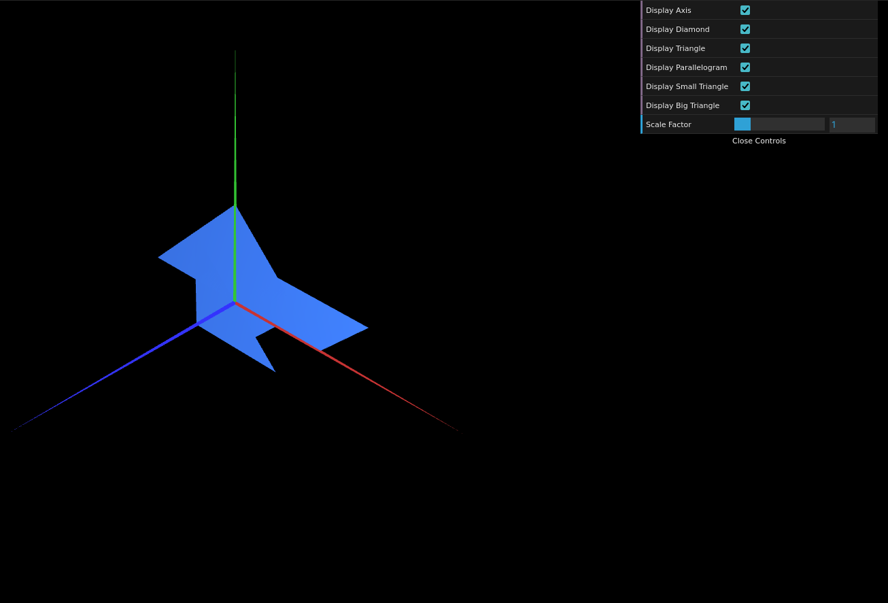
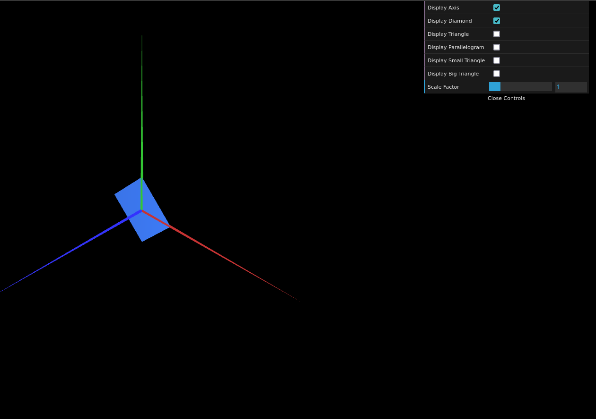
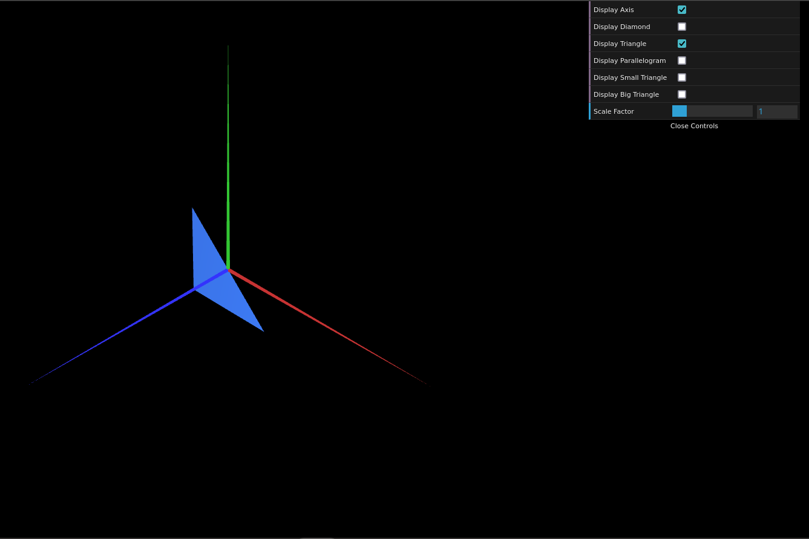
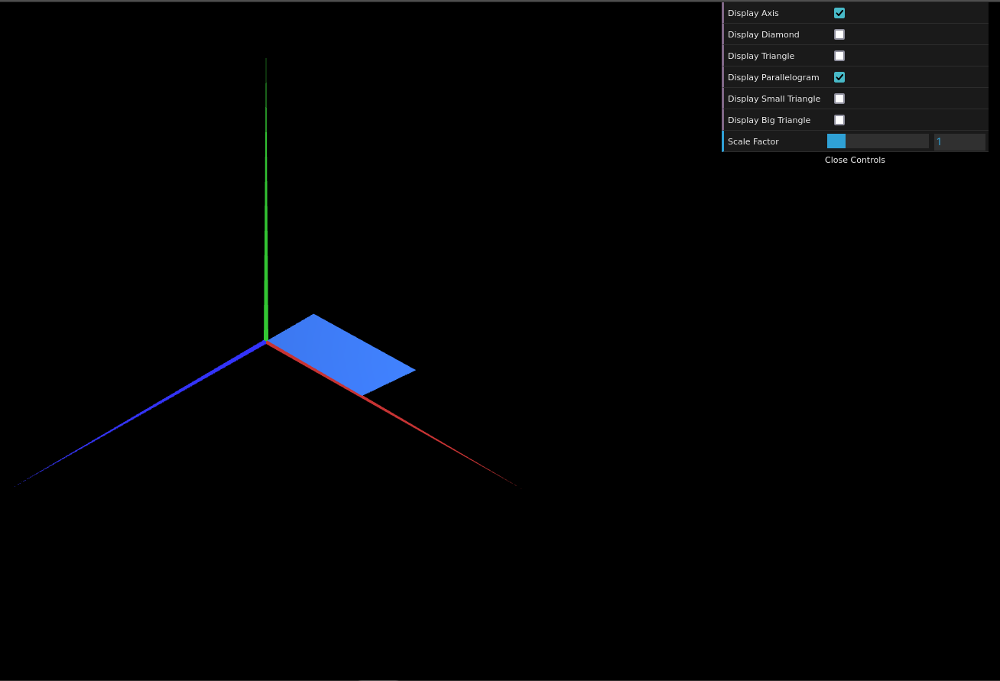
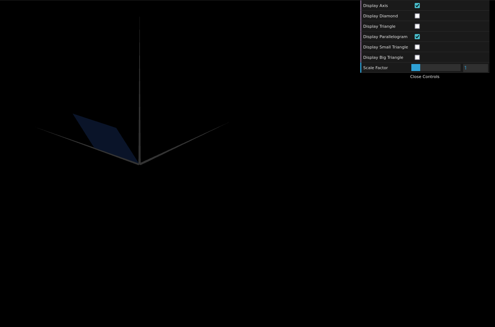
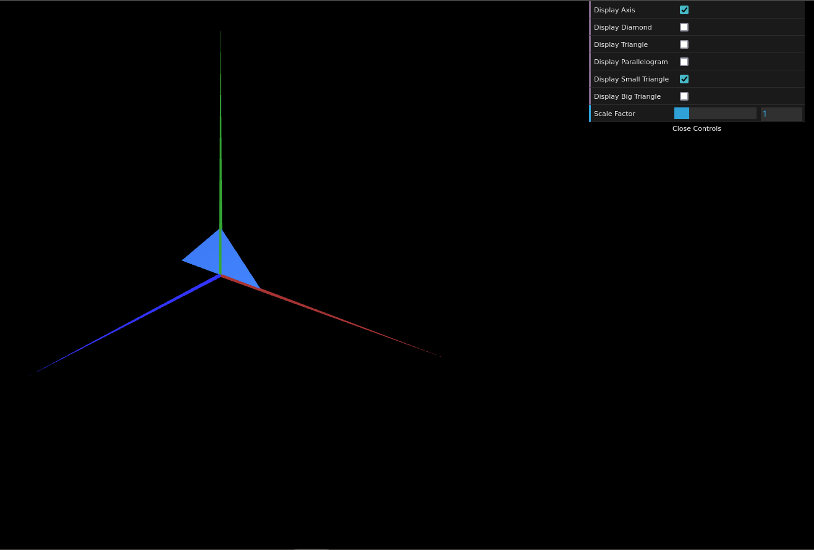
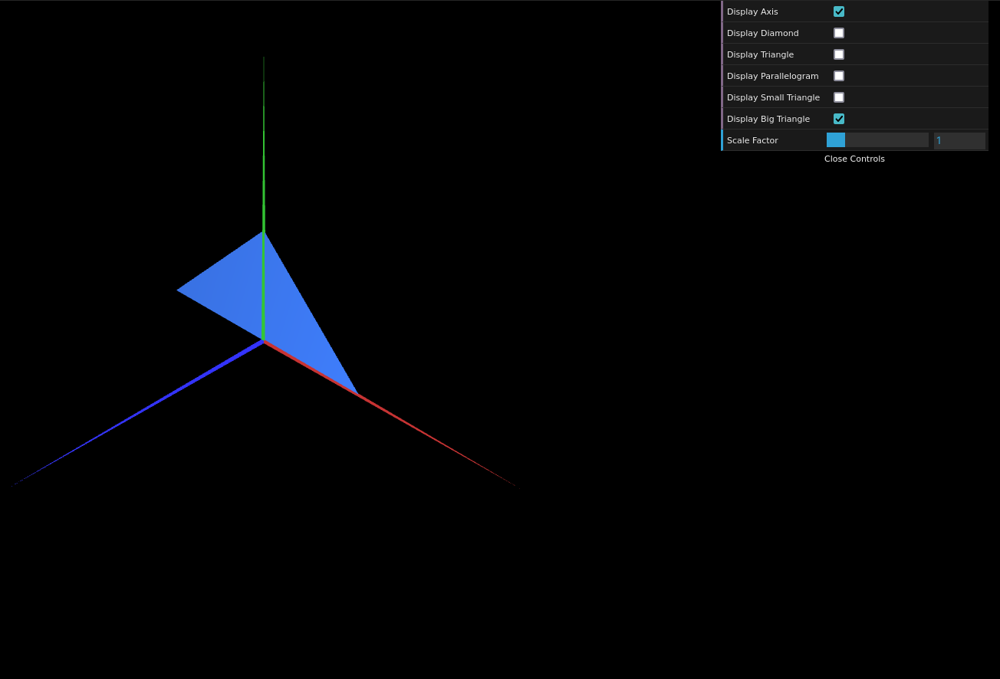

# CG 2023/2024

## Group T05G01

## TP 1 Notes

- In exercise 1 we had some difficulties at first, in understanding how exactly to render the figures in the guide. We were using a lot of triangles in the beggining, but quickly realized that that could be greatly simplified. We were also a bit confused at first about the way the order of the indices affected the displaying of the figures, but after some trial and error we understood how ordering the indices of a triangle's vertices either clockwise or counter-clockwise displayed each "side" of it. We also observed that, since the variables that we were using for that purpose, were initialized with a boolean value, adding an element with the value of that variable to the GUI, resulted in a checkbox.

- Exercise 2 was very straightforward, we simply applied the concepts we learned in the first one, to draw both triangles (we also added a visibility checkbox for both of them, just so that they stayed consistent with the rest of the figures).

- In both exercises we observed how it was possible to achieve the same result, with different configurations, such as using a different number of different triangles.

