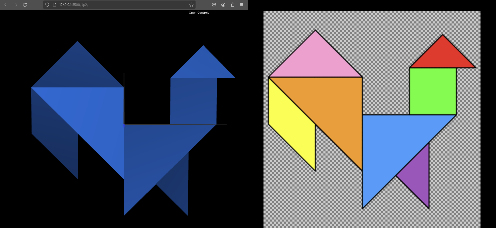
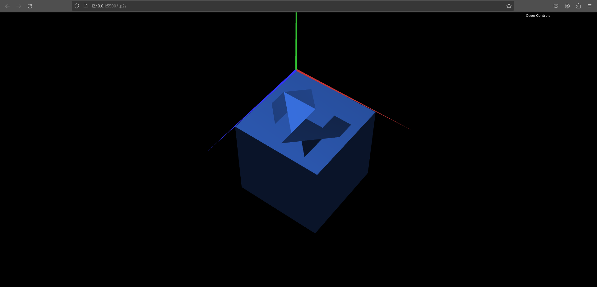

# CG 2023/2024

## Group T05G01

## TP 2 Notes

- Exercise 1: The trickiest part about drawing the tangram to us, was figuring out the right reference point for measuring things by. Analyzing our image, an wanting to consider the most centered vertex of the image as placed in the origin, we decided that our best option would be the length of one of the sides of the rotated diamond (square). Using basic trigonometry we calculated that the square had square root of 2 of side, and using that we were able to guide the translations we needed to perform. We got our result only with translations and rotations, except for the parallelogram, were we perform a scaling operation of -1, in y, representing a reflection in the same axis.

- Exercise 2: Drawing the cube was not a difficult task, with the knowledge we had from the previous class. The exercise left it quite vague exactly how the base was supposed to look, so we simply moved the unit cube behind it, scaled it on all directions, so that the top face encompassed the entire trangram, and then applied a rotation on x, and a translation to align the top-left vertex of the cube with the origin

- Exercise 3: By changing the way the cube was constructed, from a single connected mesh of triangles, to a composition of six different "Quads" with geometric transformations, we observed that the light was no longer reflected the same way at the top and side faces. The quads on the sides had a darker shade of blue, than the one at the top.

